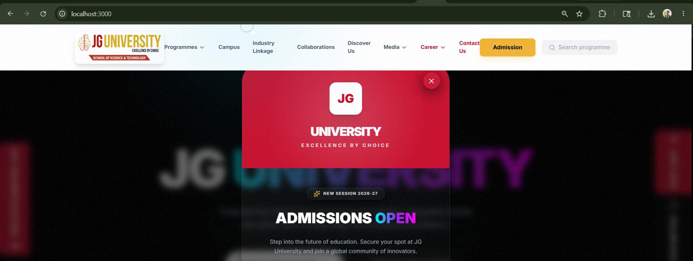

# 🏛️ JG University Portal - Institutional Excellence Edition

A world-class, high-performance university portal built with **Next.js 15 (App Router)** and **Tailwind CSS 4**. This platform features a premium "Web3-inspired" aesthetic with interactive 3D graphics, real-time search intelligence, and professional institutional modules.

## 🚀 Key Features

### 🌌 Immersive Visual Experience
- **Interactive 3D Hero**: A Three.js powered neural network background that responds to mouse movements for a futuristic entrance.
- **Magnetic Micro-Interactions**: A custom magnetic cursor that snaps to interactive elements, providing a premium software feel.
- **Fluid Animations**: Complex scroll-triggered animations powered by **Framer Motion** and **Lenis Smooth Scroll**.

## 📸 Website Gallery

<div align="center">
  
  
  <br />
  
  
  <br />
  
  
  <br />
  
  
  <br />
  
  
</div>

## 🎥 Video Walkthrough
<div align="center">
  <video src="public/assets/Screen%20Recording%202026-05-15%20164200.mp4" width="100%" controls>
    Your browser does not support the video tag.
  </video>

## 🔗 Live Demo
[View Live Website](https://jg-university.vercel.app) *(Deploy on Vercel to activate link)*

### 🔍 Intelligent Functionality
- **Real-time Search Intelligence**: A global search system integrated into the Navbar that filters through all academic programmes instantly.
- **Dynamic Mega Menu**: A high-density navigation system with multi-column layouts for schools and programmes.
- **Advanced Forms**: Career recruitment portal with file upload capabilities and secure contact hubs with Google Maps integration.

### 🏢 Institutional Modules
- **Academic Catalog**: Detailed accordion-based views of Management, Engineering, Law, and Applied Sciences.
- **Global Collaborations**: Highlighting partnerships with international institutions like **Carleton University (Canada)**.
- **Industry Linkage**: Dedicated mentorship carousels featuring industry leaders and corporate partner marquees.
- **Campus Life**: Comprehensive view of facilities, ERP-integrated library, and upcoming visionary campus.

## 🛠️ Tech Stack

- **Framework**: Next.js 15 (App Router)
- **Styling**: Tailwind CSS 4
- **Animations**: Framer Motion
- **3D Engine**: Three.js (@react-three/fiber, @react-three/drei)
- **Icons**: Lucide React
- **Carousels**: Swiper.js
- **Scrolling**: Lenis (Studio Freight)

## 📁 Professional Project Architecture

The repository is structured following **Enterprise Next.js standards**, utilizing Atomic Design principles to ensure high maintainability and horizontal scalability.

```plaintext
jg-university-portal/
├── public/
│   └── assets/           # Optimized institutional assets (Campus, Faculty, Home)
├── src/
│   ├── app/              # Next.js App Router (Routing, Layouts, Global Styles)
│   │   ├── favicon.ico
│   │   ├── globals.css   # Main CSS with Tailwind 4 custom tokens
│   │   ├── layout.tsx    # Root layout with font & provider injections
│   │   └── page.tsx      # Main Entry Point (Assembling sections)
│   ├── components/       # Atomic component library
│   │   ├── layout/       # Global persistent components (Navbar, Footer, Sidebars)
│   │   ├── sections/     # High-level page organisms (Hero, Campus, Catalog)
│   │   ├── ui/           # Reusable dumb components & 3D engines (Modals, Canvas)
│   │   └── providers/    # Smooth scrolling and context wrappers
│   ├── data/             # Centralized static database (Programme catalog)
│   ├── lib/              # Utility functions and shared logic
│   └── hooks/            # Custom React hooks (Scrolling, interactions)
├── .gitignore            # Production-grade exclusion rules
├── next.config.ts        # Optimized Next.js configuration
├── package.json          # Dependency management & build scripts
├── README.md             # Project documentation
└── tsconfig.json         # Strict TypeScript configuration
```

## 🧠 Development Philosophy & Approach

This project was built with a **"Performance-First, Aesthetics-Always"** mindset, specifically designed for a modern educational institution:

1.  **Immersive Experience**: Used **Three.js** and **Framer Motion** to create a "living" digital environment that appeals to tech-savvy students.
2.  **Scalable Data**: Instead of hardcoding content, I created a **Centralized Data Layer** in `src/data/`, allowing the university to update their 20+ programmes in one single location.
3.  **Modular Components**: Every section is an isolated module. This means the hiring company can easily extract the "Campus Gallery" or "Programme Search" and reuse them on different pages.
4.  **UX Polish**: Implemented **Lenis Smooth Scroll** and **Custom Magnetic Cursors** to elevate the interface from a "website" to a "premium web application."

## 🏁 Getting Started

### Prerequisites
- Node.js 18.17 or later
- npm / yarn / pnpm

### Installation
1. Clone the repository:
   ```bash
   git clone https://github.com/madhan175/jg-university-.git
   ```
2. Install dependencies:
   ```bash
   npm install
   ```
3. Run the development server:
   ```bash
   npm run dev
   ```
4. Open [http://localhost:3000](http://localhost:3000) to view the portal.

## 🏛️ About JG University
JG University is a Tech-Driven institution sponsored by the **ASIA Charitable Trust** (established 1965). The portal reflects the university's philosophy of "Excellence by Choice," bridging the gap between academia and future-ready industry demand.

